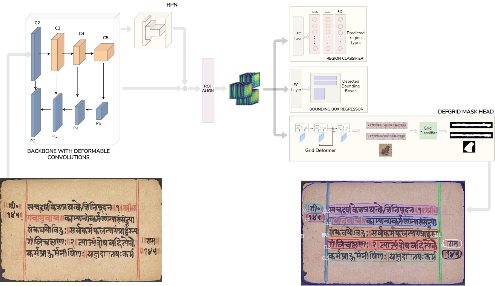
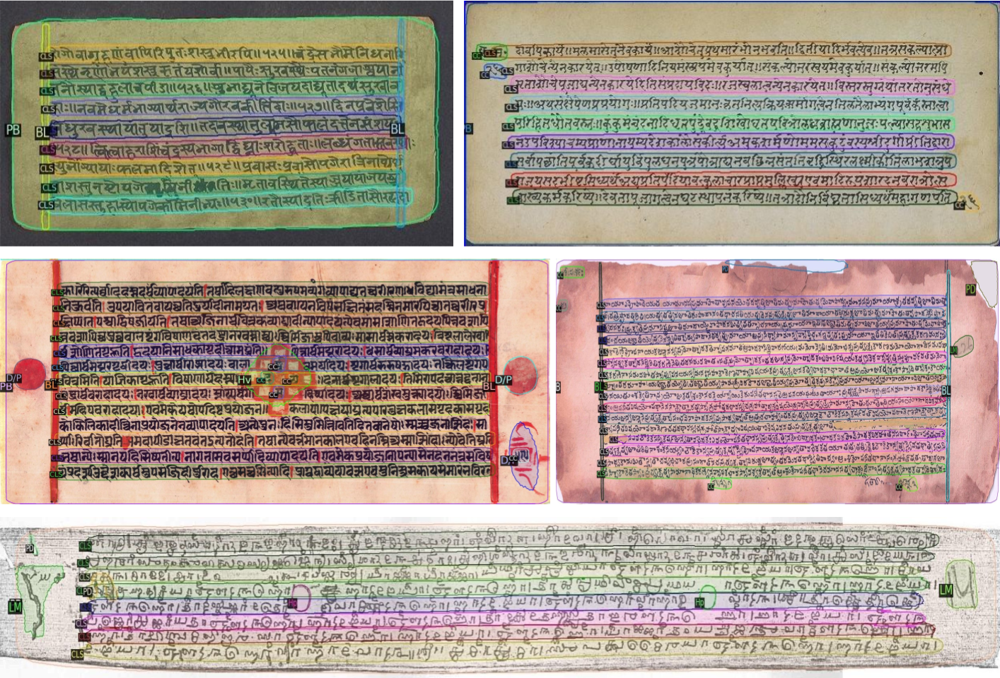

<div align="center">

<samp>

<h1> PALMIRA </h1>

<h2> A Deep Deformable Network for Instance Segmentation of Dense and Uneven Layouts in Handwritten Manuscripts </h2>

</samp>

**_To appear at [ICDAR 2021](https://icdar2021.org/)_**

| **[ [```Paper```](<https://drive.google.com/file/d/163h9c30sWuxw2VxcmEwvUMnjHzJk8lNE/view?usp=sharing>) ]** | **[ [```Website```](<https://ihdia.iiit.ac.in/Palmira/>) ]** |
|:-------------------:|:-------------------:|

<br>




<b> Teaser Video (Click on image below) </b>
<br>

[](http://www.youtube.com/watch?v=V4XWngkrtxQ "Palmira teaser video")
    
---

</div>

<!-- # Getting the Dataset
> Will be released soon! -->

# Dependencies and Installation

## Manual Setup

The PALMIRA code is tested with

- Python (`3.7.x`)
- PyTorch (`1.7.1`)
- Detectron2 (`0.4`)
- CUDA (`10.0`)
- CudNN (`7.3-CUDA-10.0`)

For setup of Detectron2, please follow
the [official documentation](https://detectron2.readthedocs.io/en/latest/tutorials/install.html)

## Automatic Setup (From an Env File)

We have provided environment files for both Conda and Pip methods. Please use any one of the following.

### Using Conda

```bash
conda env create -f environment.yml
```

### Using Pip

```bash
pip install -r requirements.txt
```

# Usage

## Initial Setup:

- Download the Indiscapes-v2 **[[`Dataset Link`](https://github.com/ihdia/indiscapes)]**
- Place the
    - Dataset under `images` directory
    - COCO-Pretrained Model weights in the `init_weights` directory
        - Weights
          used: [[`Mask RCNN R50-FPN-1x Link`](https://dl.fbaipublicfiles.com/detectron2/COCO-InstanceSegmentation/mask_rcnn_R_50_FPN_1x/137260431/model_final_a54504.pkl)]
    - JSON in `doc_v2` directory (a sample JSON has been provided [here](https://github.com/ihdia/Palmira/blob/main/doc_v2/via_region_data.json))

More information can be found in folder-specific READMEs.

- [images/README.md](images/README.md)
- [doc_v2/README.md](doc_v2/README.md)
- [init_weights/README.md](init_weights/README.md)

### SLURM Workloads

If your compute uses SLURM workloads, please load these (or equivalent) modules at the start of your experiments. Ensure
that all other modules are unloaded.

```bash
module add cuda/10.0
module add cudnn/7.3-cuda-10.0
```

## Training

### Palmira

Train the presented network

```bash
python train_palmira.py \
    --config-file configs/palmira/Palmira.yaml \
    --num-gpus 4
```

- Any required hyper-parameter changes can be performed in the `Palmira.yaml` file.
- Resuming from checkpoints can be done by adding `--resume` to the above command.

### Ablative Variants and Baselines

Please refer to the [README.md](configs/README.md) under the `configs` directory for ablative variants and baselines.

## Inference

### Quantitative

To perform inference and get quantitative results on the test set.

```bash
python train_palmira.py \
    --config-file configs/palmira/Palmira.yaml \
    --eval-only \
    MODEL.WEIGHTS <path-to-model-file> 
```

- This outputs 2 json files in the corresponding output directory from the config.
    - `coco_instances_results.json` - This is an encoded format which is to be parsed to get the [qualitative results](https://github.com/ihdia/Palmira#qualitative)
    - `indiscapes_test_coco_format.json` - This is regular coco encoded format which is human parsable
        
### Qualitative

Can be executed only after quantitative inference (or) on validation outputs at the end of each training epoch.

This parses the output JSON and overlays predictions on the images.

```bash
python visualise_json_results.py \
    --inputs <path-to-output-file-1.json> [... <path-to-output-file-2.json>] \
    --output outputs/qualitative/ \
    --dataset indiscapes_test
```

> NOTE: To compare multiple models, multiple input JSON files can be passed. This produces a single
> vertically stitched image combining the predictions of each JSON passed.

### Custom Images

To run the model on your own images without training, please download the provided weights from  **[[`here`](https://zenodo.org/record/4841067#.YPWrcugzZPY)]**.

```bash
python demo.py \
    --input <path-to-image-directory-*.jpg> \
    --output <path-to-output-directory> \
    --config configs/palmira/Palmira.yaml \
    --opts MODEL.WEIGHTS <init-weights.pth>
```

# Visual Results



# Citation

If you use PALMIRA/Indiscapes-v2, please use the following BibTeX entry.

```bibtex
@inproceedings{sharan2021palmira,
    title = {PALMIRA: A Deep Deformable Network for Instance Segmentation of Dense and Uneven Layouts in Handwritten Manuscripts},
    author = {Sharan, S P and Aitha, Sowmya and Amandeep, Kumar and Trivedi, Abhishek and Augustine, Aaron and Sarvadevabhatla, Ravi Kiran},
    booktitle = {International Conference on Document Analysis Recognition, {ICDAR} 2021},
    year = {2021},
}
```

# Contact

For any queries, please contact [Dr. Ravi Kiran Sarvadevabhatla](mailto:ravi.kiran@iiit.ac.in.)

# License

This project is open sourced under [MIT License](LICENSE).
